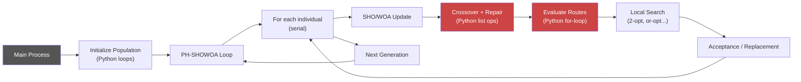
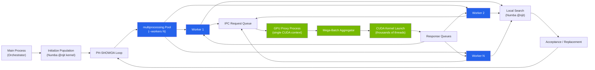

# PH-SHOWOA Python (Hybrid CPU/GPU)

PH-SHOWOA Python is a highly optimized, parallel hybrid implementation of the Spotted Hyena Optimizer and Whale Optimization Algorithm for the Vehicle Routing Problem with Simultaneous Pickup and Delivery and Time Windows (VRPSPDTW), based on the paper `journal.pone.0343262.pdf`.

This repository features a **hybrid CPU-GPU execution architecture**. The CPU manages the complex metaheuristic control logic, while the CUDA backend acts as a massive accelerator for batched route evaluations and move scoring. 

## Features

- **Blazing Fast**: Native CUDA backend and Numba CPU kernels bypass Python bottlenecks.
- **Highly Parallel**: Process-level parallel population updates (`--workers`).
- **Algorithm Options**: Solution initialization (`rcrs`, `td`), SHO-style recombination, WOA-style intensification, ablation modes (`sho`, `woa`).
- **Deep Local Search**: `2-opt`, `2-opt*`, `or-opt`, and `2-exchange`, triggered by stagnation.
- **Escape Local Optima**: Advanced removal (random, related) and insertion (greedy, regret) operators.

---

## 🛠️ Requirements & Installation

**Prerequisites:**
- Python 3.10 or newer.
- (Optional but Recommended) An NVIDIA GPU with CUDA Toolkit installed for GPU acceleration.
- Anaconda/Miniconda (Recommended for easy environment management).

**1. Create a virtual environment:**
```powershell
conda create -n phshowoa python=3.10
conda activate phshowoa
```

**2. Install the project:**
For standard CPU-only execution:
```powershell
pip install -e .
```
To unlock GPU acceleration (installs Numba and CUDA dependencies):
```powershell
pip install -e ".[cuda]"
```

**3. Prepare Benchmark Data:**
Extract the bundled benchmark datasets:
```powershell
tar -xzf data\data.tar.gz -C data
```
This will extract benchmark instances like `data\Wang_Chen\explicit_rcdp101.vrpsdptw` into the `data/` folder.

---

## 🚀 Quick Start: Maximizing Performance

To get the absolute best performance on modern hardware (especially multi-core CPUs and NVIDIA GPUs), use the following commands. These examples use large datasets where the parallel architecture shines.

### 1. The "Ultimate Hybrid Power" Command (CUDA + Multi-Processing + Full Local Search)
Run this when you want to throw everything the algorithm has at a large problem. It combines GPU acceleration, multi-core CPU parallelism, and every deep local-search operator available in the solver.

```powershell
python -m src --problem data\Wang_Chen\explicit_rcdp5001.vrpsdptw --runs 1 --pop_size 36 --max_iter 100 --compute_backend cuda --workers 0 --pruning --O_1_eval --two_opt --two_opt_star --or_opt 2 --two_exchange 2 --related_removal --removal_lower 0.25 --removal_upper 0.40 --regret_insertion
```
* **`--compute_backend cuda`**: Activates the GPU proxy backend for lightning-fast route evaluation.
* **`--workers 0`**: Spawns parallel CPU workers for all available cores to handle the massive local search load.
* **`--pruning --O_1_eval ...`**: Enables O(1) evaluation, time-window pruning, and all deep local search / ruin-and-recreate operators.

### 2. The "Maximum GPU" Command (CUDA + Multi-Processing - Basic Operators)
A simpler version that still uses full parallelism but leaves the advanced local search operators off.

```powershell
python -m src --problem data\Wang_Chen\explicit_rcdp5001.vrpsdptw --runs 1 --pop_size 36 --max_iter 100 --compute_backend cuda --workers 0
```
* **`--compute_backend cuda`**: Activates the GPU proxy backend.
* **`--workers 0`**: Spawns parallel CPU workers for all available cores.

### 3. The "Maximum CPU" Command (Multi-Core CPU Only)
If you don't have a dedicated NVIDIA GPU, you can still achieve massive speedups by maximizing CPU parallelism using Numba JIT-compiled CPU kernels.

```powershell
python -m src --problem data\Wang_Chen\explicit_rcdp5001.vrpsdptw --runs 1 --pop_size 36 --max_iter 10 --compute_backend cpu --workers 0
```
* **`--workers 0`**: Automatically detects and utilizes all available CPU cores on your machine.

---

## 📖 Basic Usage Examples

For beginners, here are some simpler commands to understand how the solver works on smaller instances.

**1. A simple basic run:**
```powershell
python -m src --problem data\Liu_Tang_Yao\200_1.vrpsdptw --runs 1 --pop_size 36 --max_iter 1000
```

**2. Save the best solution to a file:**
```powershell
python -m src --problem data\Liu_Tang_Yao\200_1.vrpsdptw --runs 1 --output result.txt
```

**3. Enable all deep local-search operators (2-opt, Or-opt, etc.) and time limits:**
```powershell
python -m src --problem data\Liu_Tang_Yao\200_1.vrpsdptw --time 60 --pruning --two_opt --two_opt_star --or_opt 2 --two_exchange 2
```

**4. Run Ablation studies (e.g., test only the Whale Optimization Algorithm mode):**
```powershell
python -m src --problem data\Liu_Tang_Yao\200_1.vrpsdptw --hybrid_mode woa
```

---

## ⚙️ Advanced Configuration

### Full Command Line Interface
Run `python -m src --help` to see all available options.

Key parameters you can tune:
- `--runs`: Number of independent runs (Default: 10).
- `--pop_size`: Population size, must be a perfect square (Default: 64).
- `--local_search_interval`: Apply deep local search every N iterations (Default: 25).
- `--stagnation_interval`: Diversify population after N iterations without improvement (Default: 50).
- `--diversify_ratio`: Fraction of population rebuilt during diversification (Default: 0.40).

### Architecture: Paper (Original) vs This Implementation

This codebase significantly extends the original paper's architecture. The table and diagrams below highlight the key differences.

| Aspect | Paper (Original) | This Implementation |
|---|---|---|
| **Execution** | Single-process, serial | Multi-process (`--workers 0` = all cores) |
| **Route Evaluation** | Pure Python loops | Numba `@njit` CPU kernels or CUDA GPU kernels |
| **Insertion Scoring** | Python list slicing per candidate | Batched kernel: one call scores all candidates × all positions |
| **GPU Support** | None | Full CUDA backend with dedicated GPU proxy process |
| **Concurrency Model** | N/A | GPU Proxy + `multiprocessing.Pool` of CPU workers |
| **Data Layout** | Python objects (`Node`, `Route`) | Contiguous NumPy arrays (cache-friendly, GPU-transferable) |
| **IPC Overhead** | N/A | Mega-batching masks queue latency |

#### Paper Architecture (Serial, Single-Process)



> **Bottleneck (red):** Route evaluation and insertion scoring run as pure Python `for` loops over every customer, every position, every route — sequentially.

#### This Implementation (Hybrid Multi-Process + GPU)



> **Green = GPU path.** The dedicated GPU Proxy process holds the only CUDA context. It collects requests from all blue CPU workers into a single mega-batch, launches one massive CUDA kernel, then fans results back out.
>
> **Blue = CPU worker pool.** Each worker runs SHO/WOA updates, crossover, and local search in parallel. Heavy insertion scoring is delegated to the GPU proxy via fast IPC queues.

#### Key Components

1. **`GpuProxyBackend`** — A multi-process-safe wrapper that spawns a dedicated GPU process. Worker processes serialize route/insertion requests onto a shared queue; the proxy drains the queue, mega-batches them, and launches a single CUDA kernel.
2. **`CudaComputeBackend`** — Direct CUDA backend using Numba `@cuda.jit` kernels for batched route evaluation and insertion scoring. Used inside the GPU proxy process.
3. **`BaseComputeBackend`** — Pure Numba `@njit` CPU kernels. Still significantly faster than raw Python thanks to compiled machine code and `nogil` parallelism.
4. **Mega-Batching** — The GPU proxy doesn't process one worker's request at a time. It drains the queue to collect requests from multiple workers, concatenates all routes into one giant batch, and launches a single kernel. This saturates GPU cores and amortizes kernel launch overhead.

### Input Instance Format
The solver expects files with `EDGE_WEIGHT_TYPE: EXPLICIT`. The format looks like this:
```text
NAME: <instance_name>
TYPE: <problem_type>
DIMENSION: <number_of_nodes_including_depot>
VEHICLES: <number_of_vehicles>
DISPATCHINGCOST: <vehicle_dispatching_cost>
UNITCOST: <cost_per_distance_unit>
CAPACITY: <vehicle_capacity>
EDGE_WEIGHT_TYPE: EXPLICIT
NODE_SECTION
<node_id>,<delivery>,<pickup>,<start_time>,<end_time>,<service_time>
...
DISTANCETIME_SECTION
<from_node>,<to_node>,<distance>,<travel_time>
...
DEPOT_SECTION
<depot_node_id>
```

### Benchmarking Scripts

**Batch Run Against Paper Targets:**
Run repeated multi-instance comparisons with per-instance logs and summaries:
```powershell
python scripts\compare_with_paper_logged.py --compute_backend cuda
```

**Kaggle Benchmark:**
To compare CPU and CUDA directly on a Kaggle notebook environment:
```powershell
python scripts\kaggle_run.py --backends cpu cuda
```
